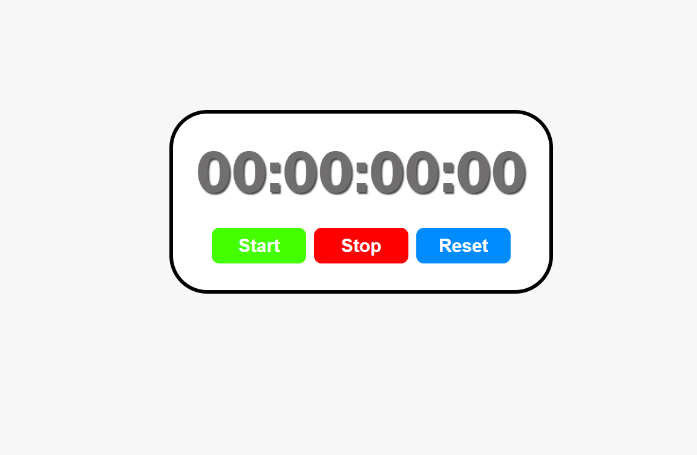
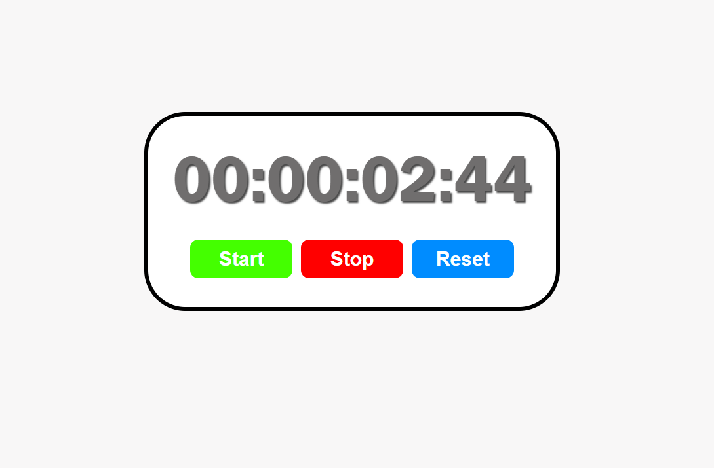

# ⏱️ StopWatch App

A simple, clean stopwatch application built with **React**, **HTML**, **CSS**, and **JavaScript**.

---

## 📸 Features

- ▶️ **Start** — begins or resumes the timer
- ⏹️ **Stop** — pauses the timer at the current time
- 🔄 **Reset** — resets the timer back to `00:00:00:00`
- Displays time in `HH:MM:SS:ms` format
- Accurate to the **centisecond** (10ms intervals)

---

## 🛠️ Tech Stack

| Technology | Usage |
|------------|-------|
| **React** | UI components and state management |
| **JavaScript** | Timer logic, `useRef`, `useEffect`, `useState` |
| **HTML** | Component structure/markup |
| **CSS** | Styling the display and control buttons |

---

## 🚀 Getting Started

### Prerequisites

- [Node.js](https://nodejs.org/) (v14 or higher)
- npm or yarn

### Installation

1. **Install dependencies**
   ```bash
   npm install
   ```

2. **Start the development server**
   ```bash
   npm start
   ```

3. Open [http://localhost:3000](http://localhost:3000) in your browser.

---

## 🧠 How It Works

The stopwatch uses three core React hooks:

- **`useState`** — tracks `isRunning` (boolean) and `elapsedTime` (milliseconds)
- **`useRef`** — stores the `intervalId` and `startTime` without triggering re-renders
- **`useEffect`** — starts and clears the `setInterval` whenever `isRunning` changes

### Time Calculation

```js
// On start, anchor the start time accounting for any previously elapsed time
startTimeRef.current = Date.now() - elapsedTime;

// Each tick calculates elapsed time from the anchor
setElapsedTime(Date.now() - startTimeRef.current);
```

This approach ensures the timer remains accurate after pause/resume cycles.

### Time Formatting

The `formatTime()` function breaks down raw milliseconds into individual units:

```js
let hr = Math.floor(elapsedTime / (1000 * 60 * 60));
let min = Math.floor((elapsedTime / (1000 * 60)) % 60);
let sec = Math.floor((elapsedTime / 1000) % 60);
let millsec = Math.floor((elapsedTime % 1000) / 10);
```

Each value is then padded to 2 digits with `padStart(2, "0")` and joined as `HH:MM:SS:ms`.

---

## 🖼️ Preview




//////////////////////////////////////////////////////////////////

# React + Vite

This template provides a minimal setup to get React working in Vite with HMR and some ESLint rules.

Currently, two official plugins are available:

- [@vitejs/plugin-react](https://github.com/vitejs/vite-plugin-react/blob/main/packages/plugin-react) uses [Oxc](https://oxc.rs)
- [@vitejs/plugin-react-swc](https://github.com/vitejs/vite-plugin-react/blob/main/packages/plugin-react-swc) uses [SWC](https://swc.rs/)

## React Compiler

The React Compiler is not enabled on this template because of its impact on dev & build performances. To add it, see [this documentation](https://react.dev/learn/react-compiler/installation).

## Expanding the ESLint configuration

If you are developing a production application, we recommend using TypeScript with type-aware lint rules enabled. Check out the [TS template](https://github.com/vitejs/vite/tree/main/packages/create-vite/template-react-ts) for information on how to integrate TypeScript and [`typescript-eslint`](https://typescript-eslint.io) in your project.
